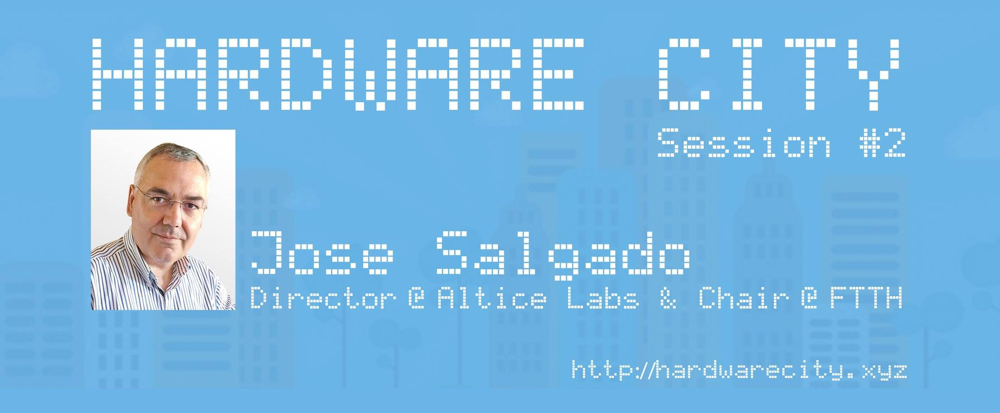
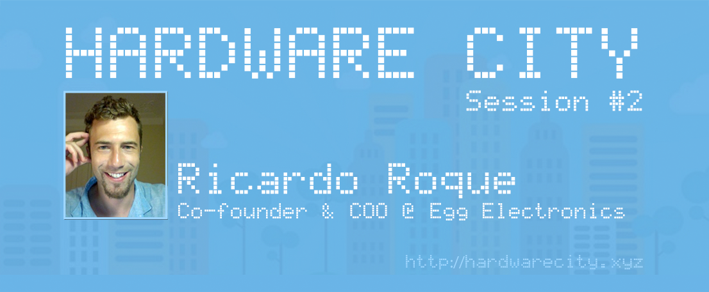
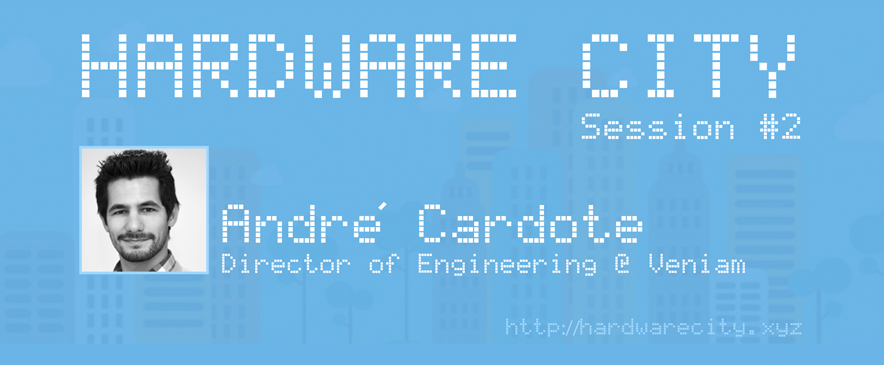

## Hardware City Session #2



Hardware City Session #2: Building Bridges in Hardware Innovation
We are thrilled to share the success of our second Hardware City Session, hosted graciously by Olaria Bar Aveiro and set against the backdrop of the historic Ceramic Factory “Jeronymo Pereira Campos (1916)”. The evening was nothing short of exceptional as we dive deeper into the realms of hardware product development, fostering a vibrant community of innovators.
Our event saw the convergence of passionate minds, eager to explore the challenges and triumphs of hardware entrepreneurship. Amidst the warm ambiance and camaraderie, our esteemed guests illuminated the path forward with their invaluable experiences and insights.
Meet Our Speakers:
* José Salgado graced us with his expertise gained through various roles at Altice Labs, steering us through the complexities of hardware development and production within the industry context. His vision for the future resonated with hardware startup entrepreneurs, providing a nuanced understanding of the challenges that lie ahead.
* Ricardo Roque, a seasoned entrepreneur and founding team member of Silicon Valley's Noatta Inc. and co-founder of Egg Electronics, shared his journey marked by research stints at renowned institutions like Xerox-PARC and Abaxis Inc. Ricardo's discussion shed light on the pains of launching a hardware company and offered strategic insights to overcome these hurdles.
* André Cardote, the Director of Engineering at Veniam, brought a wealth of knowledge rooted in his Ph.D. in Electronics and Telecommunications Engineering. His expertise in developing inter-vehicle communication solutions and deploying vehicular networks provided a glimpse into the promising future of hardware innovations.
The evening was not just about insights but also about forging connections and nurturing a community passionate about pushing the boundaries of hardware development.
We extend our gratitude to our distinguished speakers, attendees, and our host venue for making Hardware City Session #2 an incredible success! Stay tuned for more captivating sessions as we continue our journey in unraveling the intricacies of hardware innovation.
Join us for the next Hardware City Session as we dive deeper into the dynamic world of hardware development and celebrate the spirit of innovation!



### José Salgado
__Director__ @ [Altice Labs](https://www.alticelabs.com) & Chair [FTTH](https://www.ftthcouncil.eu/knowledge-centre/what-is-ftth)




### Ricardo Roque
__Co-founder__ & __COO__ @ [Egg Electronics](https://www.eggelectronics.com)




### André Cardote
__Director of Engineering__ @ [Veniam](https://veniam.com)




