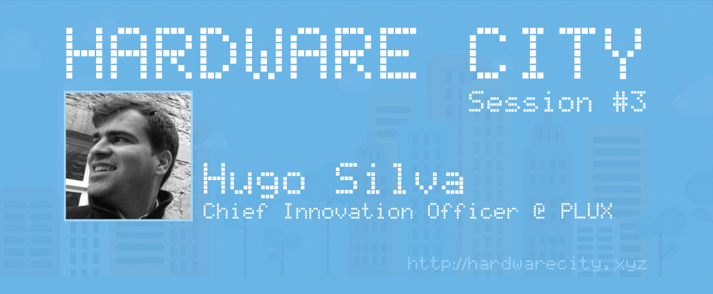
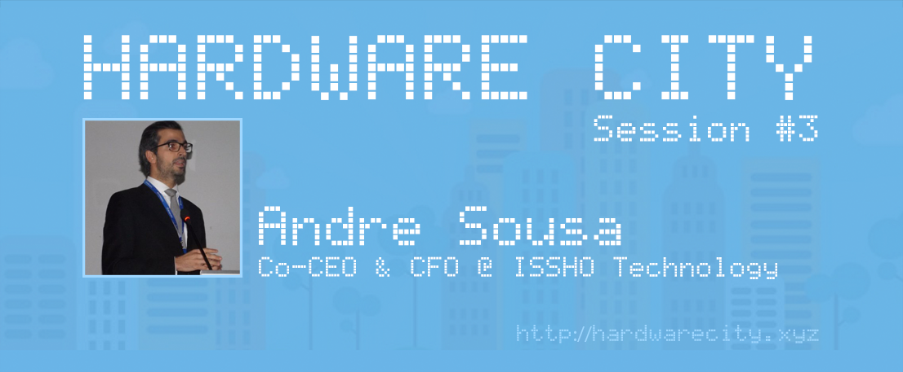
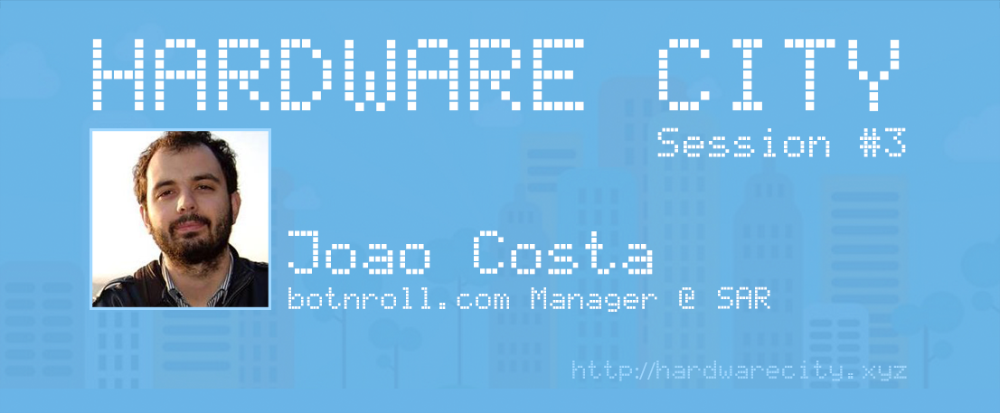

## Hardware City Session #3



Hardware City Session #3: Unveiling Innovations and Overcoming Challenges
We're delighted to announce the triumphant return of Hardware City Session #3, hosted in partnership with the Câmara Municipal de Aveiro at the esteemed "Centro Cultural e de Congressos de Aveiro." This session marked a milestone in our journey, boasting enhanced facilities and a robust lineup of innovators poised to inspire and educate.
The atmosphere crackled with anticipation as hardware enthusiasts gathered at the historic Ceramic Factory “Jeronymo Pereira Campos (1916),” now transformed into the state-of-the-art Centro Cultural e de Congressos de Aveiro. Here, amidst cutting-edge equipment and new resources, we embarked on an enlightening discourse on hardware product development and strategies to surmount obstacles.
Meet Our Visionaries:
* André Sousa, the Co-CEO and CFO of ISSHO Technology, captivated the audience with a revolutionary approach to custom furniture manufacturing rooted in 3D design. His insights unveiled new dimensions in product creation, redefining the possibilities within the furniture industry.
* Hugo Silva, the Chief Innovation Officer at PLUX – Wireless Biosignals, shared his groundbreaking work in revolutionizing product development and testing methodologies using physiological sensors. His vision offers a paradigm shift in how developers innovate and validate their products.
* João Costa, the botnroll.com manager at SAR – Soluções de Automação e Robótica, brought to light his expertise in robots and their applications within the educational market. His experiences offered a glimpse into the dynamic world of robotics, emphasizing its potential in shaping the future of education.
This session not only showcased remarkable innovations but also provided a platform for a maker to pitch a new product, fostering creativity and entrepreneurial spirit within our community.
We extend our heartfelt appreciation to our esteemed speakers, attendees, and the Câmara Municipal de Aveiro for their invaluable support in making Hardware City Session #3 a resounding success!
Stay tuned for our upcoming sessions as we continue our odyssey to unravel the intricacies and advancements in hardware innovation.
Join us for our next Hardware City Session, where we continue to unravel the mysteries and possibilities of hardware development, creating ripples of innovation in our ever-evolving landscape!

## Guests



### Hugo Silva
Chief Innovation Officer @ PLUX - Wireless Biosignals




### André Sousa
Co-CEO & CFO @ ISSHO Technology




### João Costa
Brand Manager @ SAR - Soluções de Automação e Robótica













