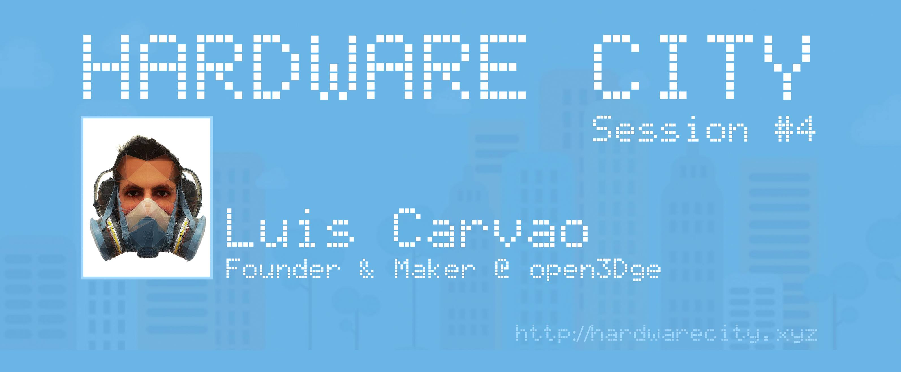
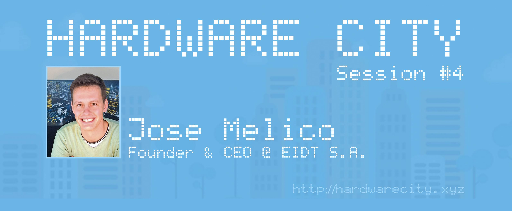
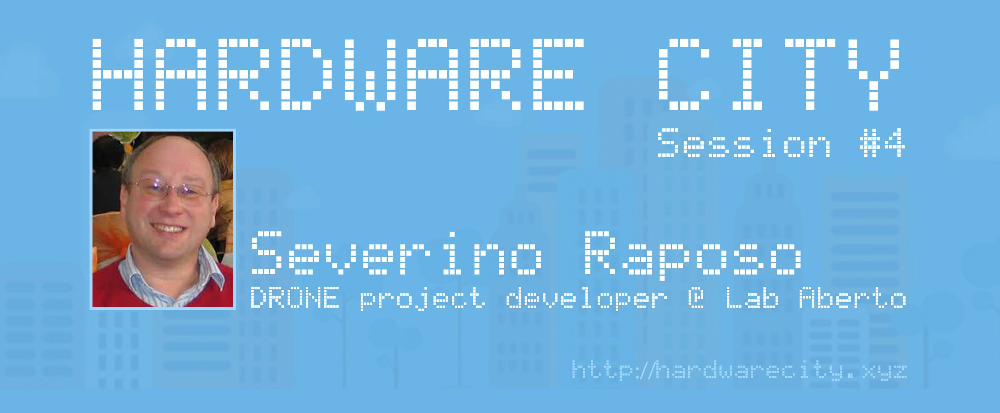

# Hardware City Session #4: Embracing Innovation at European Maker Week



Get ready for an extraordinary edition of HARDWARE CITY SESSION as we join forces with the EUROPEAN MAKER WEEK for an event that promises to be nothing short of monumental! Hosted by the gracious "Centro Cultural e de Congressos de Aveiro," this session, scheduled within the European Maker Week, is set to elevate the spirit of creativity and innovation.

Mark your calendars for May 31, 2016, and brace yourself for an immersive journey into the realm of the Maker Community and FabLabs. This session is packed with exhilarating discussions led by four trailblazing guests who will unravel the essence of FabLabs and the intricate process of productization. Get ready for surprises, including a Digital Fabrication crash course and sneak peeks into fascinating projects like drones!

What's in Store:

Luís Carvão, an ardent advocate of technology and creativity, brings a wealth of experience from FabLab EDP and his company, "open3Dge." His journey from architecture to leading training initiatives and automated machine making for small industries promises insights into the fusion of technology and creativity.

José Meliço, the founder and CEO of EIDT S.A., will share his journey of innovation in developing a drain water heat recovery system - the ZYPHO, showcasing the real impact of inventive solutions in everyday life.

António Gonçalves, a multifaceted individual passionate about open projects and education, will present the fascinating world of "LAB Aberto," a mini FAB LAB at Torres Vedras. His projects span from drones to 3D printing, reflecting a commitment to collaborative learning and innovative creations.

Severino Raposo, an Electronics and Telecommunications graduate, will take us through his remarkable projects, including UAV flight vehicles and electrical data acquisition systems. His expertise in hardware-related ventures is bound to leave us in awe!

The session also welcomes makers to showcase their projects, fostering a space for creativity and collaboration. For those unable to attend physically, join us via live video streaming to witness this innovative extravaganza!

We extend our gratitude to our exceptional guests, the EUROPEAN MAKER WEEK, and the Câmara Municipal de Aveiro for their invaluable support in crafting this groundbreaking session.

Stay tuned for more updates and revelations about the upcoming Hardware City Session #4! Embrace the maker spirit and join us in celebrating innovation and creativity.



### Luís Carvão



### José Meliço



### António Gonçalves


### Severino Raposo



